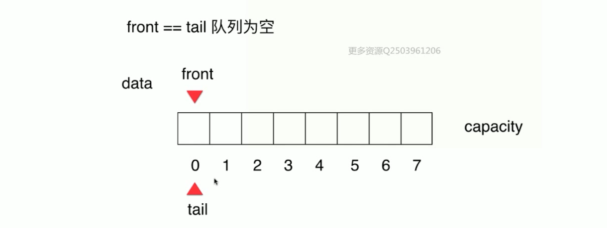
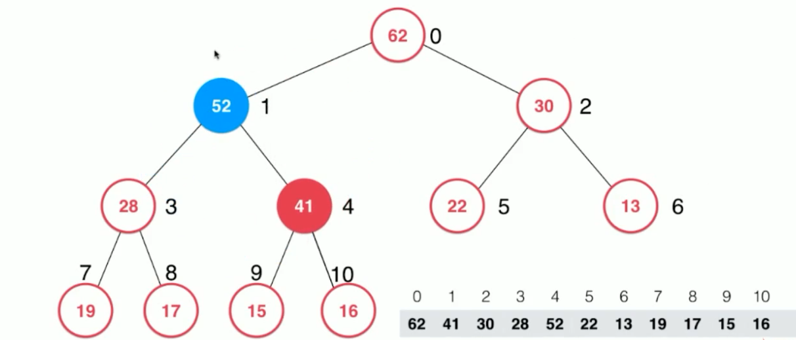
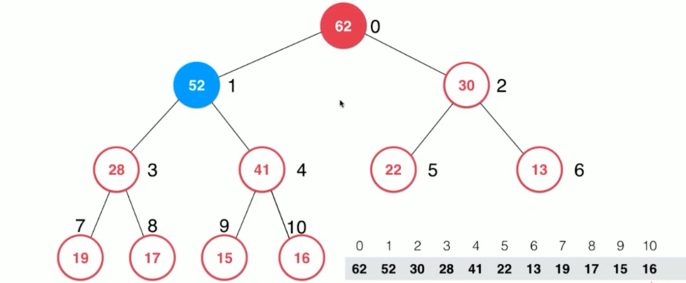

# 第 2 章 数组

# 第 3 章 栈和队列

## 3.1 栈 Stack

- 栈也是一种线性结构
- 相比数组，栈对应的操作是数组的子集
- 只能从一端添加元素，也只能从一端取出元素
- 这一端成为栈顶


## 3.2 栈的应用


## 3.3 队列 Queue

- 线性结构
- 相比数组，队列对应的操作是数组的子集
- 只能从一端（队尾）添加元素，只能从另一端（队首）取出元素


### 3.3.1 时间复杂度

|   ArrayQueue<E>   | 时间复杂度 |
| :---------------: | :--------: |
| void enqueue (E)  | O(1) 均摊  |
|    E dequeue()    |    O(n)    |
|     E front()     |    O(1)    |
|   int getSize()   |    O(1)    |
| boolean isEmpty() |    O(1)    |

### 3.3.2 删除元素 O（n）问题


## 3.4 循环队列




### 3.4.1 时间复杂度

|   LoopQueue<E>    | 时间复杂度 |
| :---------------: | :--------: |
| void enqueue (E)  | O(1) 均摊  |
|    E dequeue()    | O(1) 均摊  |
|     E front()     |    O(1)    |
|   int getSize()   |    O(1)    |
| boolean isEmpty() |    O(1)    |

# 第 4 章 链表


数据存储在节点（Node）中

```java
class Node{
  E e;
  Node next;
}

1->2->3->null
```

优点：真正的动态，不需要处理固定容量的问题
缺点：丧失了随机访问的能力

## 4.1 与数组对比

- 数组最好用于索引有语意的情况。scores[2]
- 最大的优点:支持快速查询

- 链表不适合用于索引有语意的情况。
- 最大的优点:动态

## 4.2 虚拟头节点


## 4.3 删除


## 4.4 时间复杂度

| 操作 |             时间复杂度              |
| :--: | :---------------------------------: |
|  增  | O(n)； 如果只对链表头进行操作：O(1) |
|  删  | O(n)； 如果只对链表头进行操作：O(1) |
|  改  |                O(n)                 |
|  查  |    O(n)； 只查链表头的元素：O(1)    |

## 4.5 链表实现队列


# 第 5 章 链表和递归

# 第 6 章 二分搜索树

## 6.1 二叉树

```java
class Node{
    E e;
    Node left;
    Node right;
}
```

- 和链表一样，动态数据结构
- 二叉树具有唯一根节点
- 二叉树每个节点最多有两个孩子
- 具有天然递归结构
- 二叉树不一定是“满”的（一个节点也是二叉树）

## 6.2 二分搜索树

- 满足二叉树性质
- 每个节点的值，大于其左子树的所有节点的值，小于其右子树所有节点的值
- 每一棵子树都是二分搜索树
- 存储的元素必须有可比较性

## 6.3 前序遍历

```js
function traverse(node) {
  if (node == null) return;

  访问该节点;
  traverse(node.left);
  traverse(node.right);
}
```

## 6.4 中序遍历

应用：结果是顺序的

```js
function traverse(node) {
  if (node == null) return;

  traverse(node.left);
  访问该节点;
  traverse(node.right);
}
```

## 6.5 后序遍历

应用：为二分搜素树释放内存

```js
function traverse(node) {
  if (node == null) return;

  traverse(node.left);
  traverse(node.right);
  访问该节点;
}
```

## 6.6 层序遍历(广度优先遍历)


借助队列实现

## 6.7 二分搜索树删除节点

### 第一步


### 第二步


### 第三步


### 优点

- 可以更快找到问题的解
- 常用于算法设计中-最短路径
- 图中的深度优先遍历和广度优先遍历

# 第 7 章 集合和映射

## 时间复杂度

|      | 链表 |       二分搜索树       |
| :--: | :--: | :--------------------: |
| 集合 | O(n) | 平均 O(logn) 最差 O(n) |
| 映射 | O(n) | 平均 O(logn) 最差 O(n) |

# 第 8 章 优先队列和堆

## 8.1 优先队列

- 普通队列：先进先出；后进后出
- 优先队列：出队顺序和入队顺序无关；和优先级相关

### 8.1.1 时间复杂度

|              |  入队   | 出队（拿出最大元素） |
| :----------: | :-----: | :------------------: |
| 普通线性结构 |  O(1)   |         O(n)         |
| 顺序线性结构 |  O(n)   |         O(1)         |
|      堆      | O(logn) |       O(logn)        |

## 8.2 二叉堆

### 8.2.1 性质

- 堆中某个节点的值总是不大于其父节点的值（节点的大小于节点的层次没有必然联系）
- 最大堆（相应的可以定义最小堆）
- 完全二叉树

### 8.2.2 用数组存储二叉堆


### 8.2.3 向堆中添加元素

从堆尾开始添加

#### Sift Up 操作

**1.从尾部添加元素（52）**


**2.与父节点比较，如果大于，则进行替换；此处 52>16，则 16 月 52 位置替换**


**3.同上操作；此处 52>41，则 41 月 52 位置替换**


**4.同上操作；此处 62>52，且 52>30，停止递归操作**


### 8.2.4 向堆中取出元素

从堆顶取

#### Sift down 操作

**1.取出顶部元素**


**2.尾部元素放入顶部**


**3.与左右孩子节点的最大值 52 比较**


**4.此时 16<52 的 ;则 16 与 52 位置替换**


**5.与左右孩子节点的最大值 41 比较**


**6.此时 16<28 , 所以 16 与 41 位置替换；再往下比较则没有节点或者节点小于 16，如果为叶子节点，下沉结束，退出递归**


### 8.3 heapify

将任意数组整理成堆的形状，对应每一个节点都进行下沉操作

**1. 先把任意数组看成一个完全二叉树**

**2. 从倒数第一个非叶子节点开始 sift-down，22**
如何定位最后一个非叶子节点的索引是多少（经典面试题）；只要拿到最后一个节点->然后找到其父节点


**3. 22 的子节点最大值为 62，22<62，则替换位置**


**4. 13 的子节点最大值为 41，13<41，则替换位置**


**5. 19 的子节点最大值为 28，19<28，则替换位置**


**6. 17 的子节点最大值为 22，17<22，则替换位置**


**7. 17 为叶子节点，下沉结束**


**8. 15 的子节点最大值为 62，15<62，则替换位置**


**9. 15 的子节点最大值为 41，15<41，则替换位置**


**10. 15 的子节点最大值为 30，15<30，则替换位置；因为 15 为叶子节点，所以下沉结束**


## 8.3 时间复杂度

|      | 普通线性结构 | 顺序线性结构 |   堆    |
| :--: | :----------: | :----------: | :-----: |
| 入队 |     O(1)     |     O(n)     | O(logn) |
| 出队 |     O(n)     |     O(n)     | O(logn) |

_因为二叉堆不会出现链表的形式存在，所以复杂度只能为 O(logn)级别_

|     |   add   | extractMax |                    Heapify                    |
| :-: | :-----: | :--------: | :-------------------------------------------: |
| 堆  | O(logn) |  O(logn)   | O(n)将 n 个元素逐个插入到一个空堆中，O(nlogn) |

## 用数组存储二叉堆

```java
从index为1开始
parent(i) = i / 2
left child(i) = i * 2
right child(i) = i*2 + 1


从index为0开始
parent(i) = (i-1) / 2
left child(i) = i * 2 + 1
right child(i) = i*2 + 2
```
